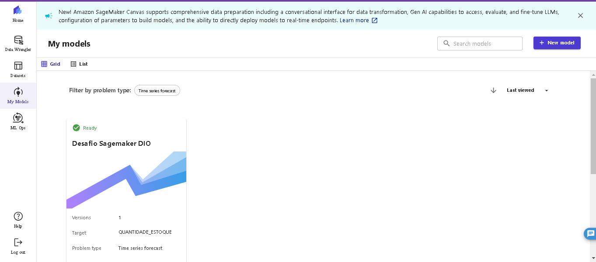
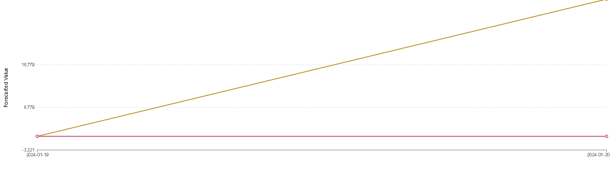
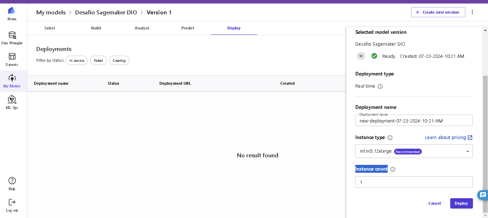

# 📊 Previsão de Estoque Inteligente na AWS com [SageMaker Canvas](https://aws.amazon.com/pt/sagemaker/canvas/)

## 🎯 Objetivos Deste Desafio de Projeto (Lab)
## 🚀 Modelo:

### Passo a Passo

### 1 - O Dataset escolhido foi "dataset-500-curso-sagemaker-canvas-dio",que salvei E foi criado com o nome de ESTOQUE

### 2 - O dataset possui 4 colunas. A coluna Target escolhida foi QUANTIDADE_ESTOQUE
O modelo de predição foi escolhido para 5 dias.

### 3 - A imagem 3 é uma correlação do tipo matrix, onde constam as relações entre o ID_PRODUTO, FLAG_PROMOCAO e a QAUNTIDADE_ESTOQUE

### 4 - As configurações do modelo escolhido foram: 

### 5 - Não foi adicionada nenhuma transformação em relação a mudança de da type, fórmula ou valores perdidos.

### 6 - Modelo em processo de análise. O método escolhido foi o quick build
A coluna Target escolhida foi: QUANTIDADE_ESTOQUE, já que o objetivo era predizer o estoque de acordo com a data do evento e vendas realizadas até lá.

### 6.1 - Modelo de predição gerado pronto Canvas_1721738188

### 7 - Detalhes Modelo de predição gerado Canvas_1721738188

### 8 - predição para o produto 4 com flag de promoção 1

### 9 - Modelo selecionado pronto para Deploy:  infelizmente não poderei passar daqui, pois serei cobrada pela implantação 

